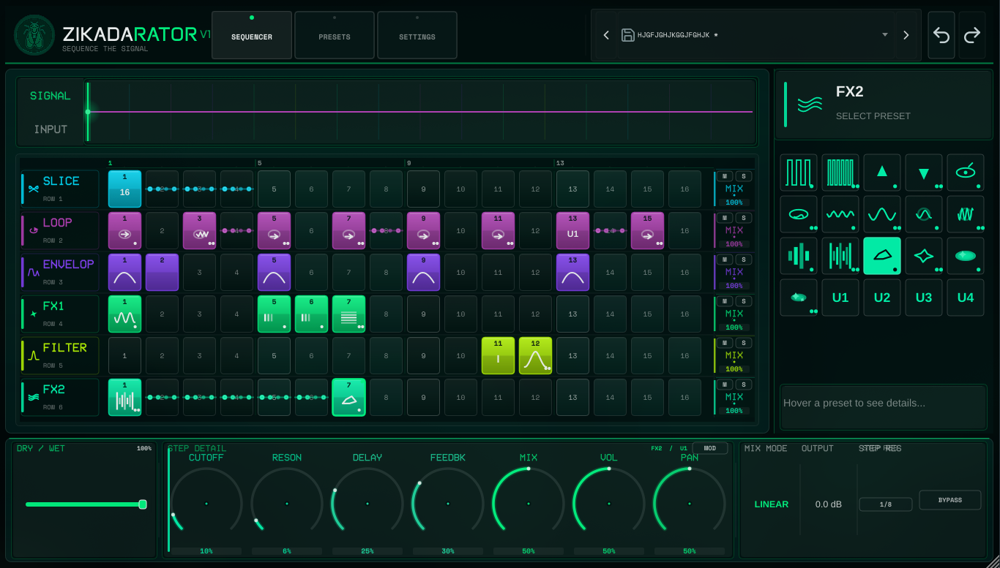

# ZIKADARATOR

A 2026-worthy VST FX plugin inspired by Sugarbytes Looperator, built for the Zikada brand identity.



## Concept

**"Sequence the signal."**

ZIKADARATOR is a 16-step multi-FX sequencer that transforms incoming audio in real-time. Chop, stutter, filter, and reshape loops through 6 independent lanes, each with per-step preset assignment, footer-based user-slot editing, and an integrated preset/settings workspace.

## Quickstart

**Installer (Windows, MacOS & Linux)**
- ([/releases/tag/v0.1.0-alpha.1](https://github.com/cedric-albeke/zikadarator/releases/tag/v0.1.0-alpha.1))

## Features

- **16-step FX sequencer** with 6 sequenced FX lanes
- **Sample-accurate step segmentation** driven by host PPQ or free clock, with 1/16, 1/8, 1/4, and 1/2 step resolutions
- **Realtime history buffers** for slice and loop playback
- **Frozen loop snapshots** so LOOP presets repeat a captured audio window instead of chasing the live rolling input
- **Correct per-lane mix routing** so lane mix blends that lane's result without turning down the whole track
- **Implemented LOOP lane preset families** for forward/reverse windows, speed variants, slow variants, reverse speed variants, and long tails
- **Corrected delay/filter DSP contracts**: fractional delay, real notch behavior, cascaded 24 dB filters, and implemented comb filtering
- **Realtime-safe stacked signal monitor** via separate input and processed-output audio-thread-to-UI taps, 16-step rolling waveform bins, and display-only normalization
- **Right-sidebar preset grid** for per-step assignment
- **Footer detail dock** for U1-U4 slot editing and modulation
- **Preset browser + Settings tabs** embedded directly in the main editor
- **Header preset dropdown** with favorites, recents, and direct loading
- **Fixed 3:2 editor aspect ratio** with 900x600 to 2400x1600 resize limits
- **Standalone device settings in-tab** — audio device, sample rate, buffer size, and MIDI inputs now live inside the Settings page
- **Zikada-native UI**: Neon green (`#00FF85`) on deep teal-black, VCR OSD Mono typography, vector-based custom components
- **VST3 / AU / Standalone** formats

## Tech Stack

- **Framework**: JUCE 8.x
- **Build System**: CMake 3.22+
- **Language**: C++20
- **UI**: Custom JUCE components (vector-based, zero stock LookAndFeel)

## Project Structure

```
src/
├── PluginProcessor.cpp/.h      # Main audio processor
├── PluginEditor.cpp/.h         # Main editor component
├── engine/                     # Audio engine
│   ├── SequencerEngine.cpp/.h  # 16-step sequencer core
│   ├── SliceEngine.cpp/.h
│   ├── FilterEngine.cpp/.h
│   ├── DelayEngine.cpp/.h
│   ├── ReverbEngine.cpp/.h
│   ├── BitcrushEngine.cpp/.h
│   ├── PitchEngine.cpp/.h
│   ├── ModulationEngine.cpp/.h
│   └── GainPanEngine.cpp/.h
├── state/                      # Parameter / state management
│   ├── PluginState.cpp/.h
│   ├── ParameterIDs.h
│   ├── SequencerState.h
│   └── PresetManager.cpp/.h
└── ui/                         # User interface
    ├── ZikadaLookAndFeel.cpp/.h
    ├── components/
    │   ├── VcrLabel.cpp/.h
    │   ├── StepCell.cpp/.h
    │   ├── StepGrid.cpp/.h
    │   ├── Knob.cpp/.h
    │   └── WaveformDisplay.cpp/.h
    └── panels/
        ├── HeaderPanel.cpp/.h
        ├── SequencerPanel.cpp/.h
        ├── FooterPanel.cpp/.h
        ├── SidebarPanel.cpp/.h
        └── WorkspacePanel.cpp/.h
```

## Current Editor Layout

- **Header**: Serum-inspired tab rail, in-header preset strip, undo/redo
- **Header preset strip**: popup dropdown for favorites, recent presets, full preset list, and browser access
- **Sequencer page**: Signal monitor, 6-lane step grid, right preset sidebar, footer detail dock
- **Presets page**: In-app browser for factory and user presets
- **Settings page**: Embedded JUCE standalone Audio/MIDI device selector

## Building

```bash
cmake -B build
cmake --build build --target ZikadaFX_Standalone
```

## Local Verification

On Windows, the repo currently uses the Visual Studio Build Tools CMake/CTest binaries when `cmake` is not on `PATH`.

```powershell
node scripts\source-smoke-tests.mjs
& 'C:\Program Files (x86)\Microsoft Visual Studio\2022\BuildTools\Common7\IDE\CommonExtensions\Microsoft\CMake\CMake\bin\cmake.exe' --build build --config Release --target ZikadaEngineTests
.\build\Release\ZikadaEngineTests.exe
& 'C:\Program Files (x86)\Microsoft Visual Studio\2022\BuildTools\Common7\IDE\CommonExtensions\Microsoft\CMake\CMake\bin\ctest.exe' --test-dir build -C Release --output-on-failure
& 'C:\Program Files (x86)\Microsoft Visual Studio\2022\BuildTools\Common7\IDE\CommonExtensions\Microsoft\CMake\CMake\bin\cmake.exe' --build build --config Release --target ZikadaFX_VST3
.tools\pluginval\pluginval.exe --validate-in-process --strictness-level 5 --validate "C:\Development\zikadarator\build\ZikadaFX_artefacts\Release\VST3\ZIKADARATOR.vst3"
```

## Test Build Packaging

GitHub Actions is set up to produce tester-facing artifacts for both platforms:

- **Windows:** VST3 artifact, ZIP package, and Inno Setup installer
- **macOS:** VST3 artifact, AU artifact, ZIP package, and unsigned PKG installer

For a local Windows test ZIP after a Release build:

```powershell
.\scripts\package-windows-release.ps1 -BuildDir build\aaa-release -Configuration Release
```

The script refreshes `ZIKADARATOR-v1-AAA-Release.zip` and repairs a blocked or zero-byte VST3 `moduleinfo.json` from the tracked fallback at `packaging/windows/moduleinfo.json`.

Tester docs:

- [`docs/INSTALL.md`](docs/INSTALL.md)
- [`docs/QUICKSTART.md`](docs/QUICKSTART.md)
- [`docs/RELEASE_TESTING.md`](docs/RELEASE_TESTING.md)

## Quick Start

### Windows

1. Download **`ZIKADARATOR-windows-installer`** from the latest GitHub Actions run.
2. Run `ZIKADARATOR-Setup.exe`.
3. Keep the **VST3** component enabled.
4. Open your DAW and rescan plugins if needed.
5. Load **ZIKADARATOR** on an audio track and confirm the editor opens.

Manual option: use **`ZIKADARATOR-windows-zip`** and copy `ZIKADARATOR.vst3` to `C:\Program Files\Common Files\VST3\`.

### macOS

1. Download **`ZIKADARATOR-macos-installer`** from the latest GitHub Actions run.
2. In Finder, **right-click** the `.pkg` and choose **Open**.
3. Complete the install.
4. Open your DAW and rescan plugins if needed.
5. Load **ZIKADARATOR** as a VST3 or AU plugin.

Manual option: use **`ZIKADARATOR-macos-zip`**, copy the bundles into `/Library/Audio/Plug-Ins/`, then run the `xattr` commands from [`docs/INSTALL.md`](docs/INSTALL.md).

For a tester-focused checklist, see [`docs/QUICKSTART.md`](docs/QUICKSTART.md).

## Design System

See [`docs/DESIGN_SYSTEM.md`](docs/DESIGN_SYSTEM.md) for exact brand tokens: colors, typography, spacing, and component specifications.

## Architecture

See [`docs/ARCHITECTURE.md`](docs/ARCHITECTURE.md) for the full technical architecture.

For the current engine rebuild status and known DSP limitations, see [`docs/ENGINE_REBUILD.md`](docs/ENGINE_REBUILD.md).

For future AI/developer handoffs, see [`docs/LLM_WIKI.md`](docs/LLM_WIKI.md).

## Product Spec

See [`docs/PRODUCT_SPEC.md`](docs/PRODUCT_SPEC.md) for feature requirements and roadmap.

## License

Copyright (c) Zikada. All rights reserved.
